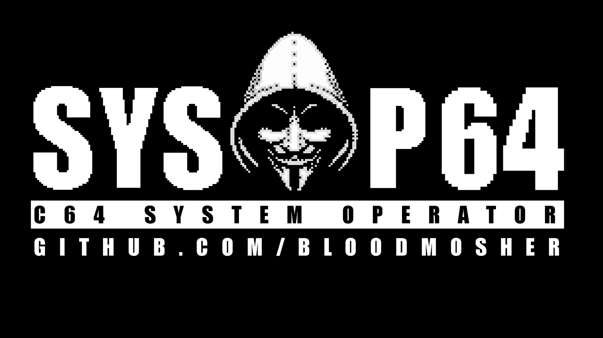
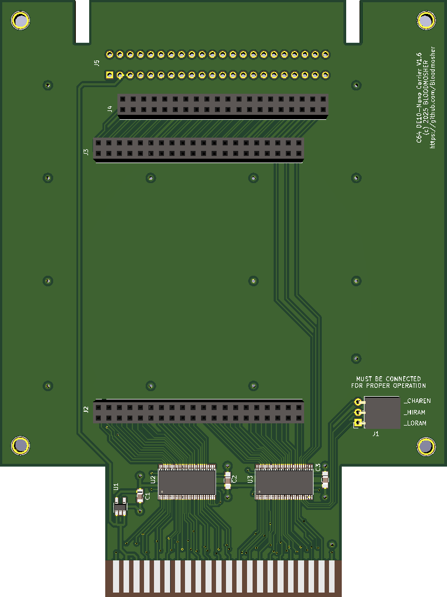

# SYSOP-64 - System Operator for the Commodore 64 - C64 Linux Cartridge

> **Note:** This directory contains the original documentation for the Sysop-64 hardware platform. The SuperCPU project uses this hardware but runs its own custom FPGA core and software stack.

### SYSOP-64 is a cartridge for the C64 that uses the DE10-Nano to power new capabilities. It provides HDMI output at 1080P, a DMA engine and programming model, a frame buffer that can be overlaid on top of the HDMI C64 video output, and a full Linux OS.

### 🚧 Under Construction - See Roadmap for More Information 🚧

## Table of Contents

- [✨ Features](#-features)
- [📦 Getting Started](#-getting-started)
- [📋 Roadmap](#-roadmap)

### Introducing Sysop-64

## 📢 News and Updates

- 📃 2025.11.22: [Alpha preview FPGA core update 5](https://github.com/Bloodmosher/Sysop-64/releases/tag/alpha-update-5) released 
- ▶️ 2025.11.20: Commodore 64 MCP Server video released on YouTube
- ▶️ 2025.11.07: More Colors Than the Amiga On Your Commodore 64 video released on YouTube
- ▶️ 2025.09.13: Xbox Controllers on the Commodore 64 video released on YouTube
- 📃 2025.09.29: [Alpha preview FPGA core update 4](https://github.com/Bloodmosher/Sysop-64/releases/tag/alpha-update-4) released 
- 📃 2025.08.27: [Alpha preview bug fix 1](https://github.com/Bloodmosher/Sysop-64/releases/tag/alpha-bugfix-1) released 
- 📃 2025.08.11: Initial github commit
- ▶️ 2025.08.10: Year of Linux on the C64 video released on YouTube
- ▶️ 2025.06.03: Introducing Sysop-64 video released on YouTube

## ✨ Features

#### 📺 Video 

- 🖥️ HDMI output at 1080P  driven at a pixel clock to match the C64 for silky smooth scrolling with no lag using ISEVIC video core 1.0
- ⏱️ Software adjusted PLL, so most users will not need to adjust the C64's clock
- 📺 Automatically detects the VIC chip model and adjusts for PAL or NTSC as needed
- 🎨 Fully configurable color palette
- 🔊 Audio capable with SID emulation
- ℹ️ Modern OLED monitors and TVs work really well. Game mode can also give an extra silky feel to scrolling images.
- ⚠️ Many IPS or TFT panels exhibit ghosting artifacts - your mileage will vary.

#### 🐧 Linux OS + Custom Software

- 🧩 Write Linux programs that run on the ARM CPU and use the C64 hardware
- 🐚 Console terminal shell that can be overlaid on top of the C64 video output
- ⌨️ USB keyboard can be used with the console terminal without impacting the C64
- 🖧  Network enabled for easy integration with your environment including SSH access
- 🖴  Large storage partition for all your favorite applications, demos, and games
- 📱 Menu application for choosing which software to run
- ℹ️ Custom binaries for C64 control (see /usr/local/bin)
- 🔴🌀 Runs Debian GNU/Linux 12 (bookworm)

#### 🧠 Advanced Capabilities

- ⚡ DMA engine and programming model facilitates easy control over the C64 from programs running on Linux
- ⚡ C64->Linux IRQ mechanism to enable Linux programs to respond to C64 events
- 🎨 Synchronize color palette changes to specific VIC lines to enable more colors on screen at once, similar to the Amiga (HDMI only)
- 〰️ Bus sampler with large memory buffer for recording and analyzing C64 signals
- 🎼 SID "spy mode" for saving raw SID data for playback and mixing  

#### 🛠️ C64 Software

- 💾 Instant loading of C64 files from Linux disk including .PRG or D64 images
- ℹ️ Simple 8K/16K cartridge .CRT files are supported
- ⚠️ More advanced cartridge support in the roadmap (e.g. bank switched, buttons)
- ℹ️ Allows use of custom kernal ROM images

## 📦 Getting Started
### Setup
- You'll need a DE10-Nano board (the MisterPi clone will also work) like [this](https://www.terasic.com.tw/cgi-bin/page/archive.pl?Language=English&CategoryNo=167&No=1046) flashed with the provided SD card image plus the SYSOP-64 carrier board for the C-64 cartridge slot (see below).
- **For correct operation, three additional wires must be run from the CPU (_CHAREN, _HIRAM, _LORAM on pins 27, 28, 29) to the carrier board.**
- Without them you'll see a correct picture upon boot, but most programs will inevitably write to IO space with a different memory configuration than the default which will result in incorrect interpretation of the signals. 
- Use Dupont wires like [these](https://www.amazon.com/dp/B07GCZV4BS) (make sure they are long enough to route outside the board), with IC mini grabbers like [these](https://www.amazon.com/dp/B08V1HFHRY) or similar.

### Supported Hardware
- PAL and NTSC "new" with automatic detection
- NTSC "old" and Drean machines are NOT supported at this time
- DE10-Nano carrier board gerbers and SD image are included in this repo
- **Reloaded MK2 motherboard is not currently supported**

### Passthrough Port
Most cartridges should work via the passthrough port, however some are more sensitive to the additional path length and sharing of the signals. **Make sure you have disabled the Sysop-64's IO space when using other cartridges** (remove "cmd 7" from c64init.sh or use "cmd 8" after boot). Examples that have been tested and seem to work well:
- 1541 Ultimate-II
- Backbit
- CMD Super CPU Rev 1A
- Epyx Fast Load
- Several simple game cartridges

The EasyFlash 3 is an example found to be more sensitive, e.g. some games failed to load in my testing. A future update may address this once fully understood.

### DE10-Nano Carrier
- The carrier board is even simpler than the ISEVIC's board and does not require additional hardware for video clock generation, which makes this board more approachable for builders.
- Gerbers for the DE10-Nano Carrier board can be found [here](./Boards/DE10-Nano/Carrier/). 
- A  [top plate](./Boards/DE10-Nano/Top_Plates/) is also provided to help prevent touching the board during operation, provide buttons for operation, and to indicate DMA activity via LEDs.

### 🖧 Shell Access and Network Setup
- The provided image contains a single user account for "root" with password set to "root", **which you should change**
- Note that the terminal shell application activated by button #3 does not require login
- The provided SD image is set to use DHCP
- To change this you'll need to locate the address assigned by your network or use a USB cable and connect via serial terminal application (e.g. PuTTY) using a baud rate of 115200
- Edit the /etc/network/interfaces file if you prefer a fixed address, see the commented example in that file. Once changed, reboot.

### Accessing Linux

## 📋 Roadmap

- [x] Release PCB gerbers, BOM and CPL files 🔥
- [ ] Release Alpha software preview SD image (🔥Coming Soon 🔥)
- [ ] Release demo and tools source code (🔥Coming Soon 🔥)
- [ ] EasyFlash cartridge support (proof of concept working)
- [ ] Advanced cartridge support
- [ ] Release FPGA verilog code and core development instructions 🎤
